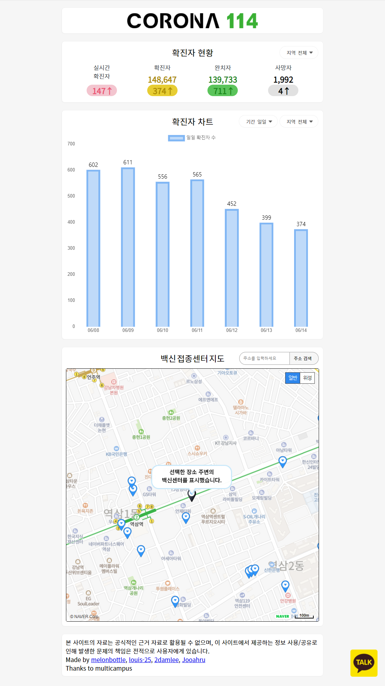

# 코로나 114

코로나 114는 방역의 사각지대에 놓인 디지털 취약계층에게 코로나 관련 정보를 접근성 높게 제공하는 것을 목적으로 개발을 진행했습니다.

## 요구사항

* STS 4.10.0
* python 3.8.8
* Java 1.8.281
* MariaDB 10.5.10
* Kakao i Open Builder Chatbot
* GiGA Genie Module

## 초기설정

* .sql 파일을 통한 테이블 생성 및 샘플 데이터 추가
* 크롤링 코드로 데이터 추가 (편의상 ipynb로 사용, 서버에 스케쥴러 적용 시, 변환 필요)
* [챗봇](https://github.com/melonbottle/Covid114Project/tree/master/Settings/chatbot) 설정
* [스피커 관련](https://github.com/louis-25/FinalProject-raspberry)  설정
* DB 커넥터 설정 변경
* API 키 변경
  * AISPeakerServiceImpl.java : line 179
  * chatbot.js : line 1
  * ChatbotServiceImpl.java : line 750
  * scripts.jsp : line 6
  * 크롤링 코드 API KEY

## 주의사항

* 브라우저의 geolocation 기능은 https 환경이나 localhost에서만 작동되는 점 유의

## 개발자

[melonbottle](https://github.com/melonbottle), [Jooahru](https://github.com/Jooahru/), [2damlee](https://github.com/2damlee), [louis-25](https://github.com/louis-25)

## 참조

[코로나 라이브](https://corona-live.com/)

