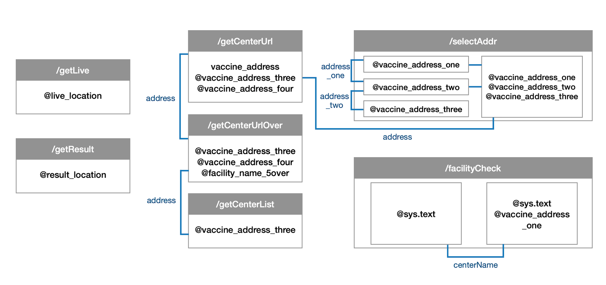

## 코로나 114 챗봇 소개

확진자 정보와 백신 접종 센터 정보를 제공하는 카카오톡 챗봇 서비스 

제공 정보: 실시간/누적 확진자 수, 백신 접종 센터 kakaomap URL

## 초기설정

* 카카오톡 채널과 개발 채널 연결 (Kakao i Open Builder)
* STS 4.10.0 챗봇 개발 환경 설정
* API 키 발급 (Kakao Developers)

## 파라미터 설정

* Skill

  mapping url 설정 - 파라미터 전송

  * 파라미터 설정 (*Intent 참조)

    | Skill url         | 파라미터명                             | 엔티티                                                       | 값(#지정값, $엔티티값)                                       |
    | ----------------- | -------------------------------------- | :----------------------------------------------------------- | ------------------------------------------------------------ |
    | /getLive          | live_location                          | @live_location                                               | $live_location                                               |
    | /getResult        | result_location                        | @result_location                                             | $result_location                                             |
    | /getCenterUrl     | vaccine_address                        | @vaccine_address_three @vaccine_address_four            | $vaccine_address                                             |
    | /getCenterUrlOver | vaccine_address                        | @vaccine_address_three @vaccine_address_four @vaccine_address_three | #address.vaccine_address                                     |
    | /getCenterList    | vaccine_address                        | @vaccine_address_three                                       | #address.vaccine_address                                     |
    | /selectAddr       | vaccine_address_one               | @vaccine_address_one @vaccine_address_two @vaccine_address_three | $vaccine_address_one #address_one.vaccine_address_one $vaccine_address_two #address_two.vaccine_address_two |
    | /facilityCheck    | vaccine_address_one facility_name | @sys.text @vaccine_address_one                          | #current $vaccine_address_one #centerName.facilityName |

  

​		

* Entity(@entity)

  사용자의 발화나 선택한 버튼을 통해 핵심 단어를 추출, 파라미터로 키워드 전송 후 DB조회 

  | 엔티티                 | 설명                                       |
  | ---------------------- | ------------------------------------------ |
  | @live_location         | 지역명(실시간 확진자 지역 조회)            |
  | @result_location       | 지역명(누적 확진자 지역 조회)              |
  | @vaccine_address_one   | 주소 index 0 (시/도)                       |
  | @vaccine_address_two   | 주소 index 0-1 (시/도, 시/군/구)           |
  | @vaccine_address_three | 주소 index 0-2 (시/도, 시/군/구, 읍/면/리) |
  | @vaccine_address_four  | 주소 index 3에 읍/면/리가 등장하는 주소값  |
  | @facility_name_5over   | 5개 이상 시설명이 중복된 시설명            |
  | @sys.text              | 발화값 전부                                |

  

* Intent

  해당 블록에서 유사블록으로 연결 및 출력 데이터 수 초과 예외처리 시 동일 파라미터를 전달하기 위해 Intent로 연결

  | Intent      | 설명                                                         |
  | ----------- | ------------------------------------------------------------ |
  | address_one | 주소 조회 버튼 출력 20 초과 예외처리 시 #주소값 연결(도/시)  |
  | address_two | 주소 조회 버튼 출력 20 초과 예외처리 시 #주소값 연결(도/시, 시/군/구) |
  | address     | 센터 조회 출력 5-15 초과 예외처리 시 #주소값 연결(도/시, 시/군/구, 읍/면/리) |
  | centerName  | 중복 시설명 기관 5개 초과 예외처리 시 #시설명 연결           |

  

